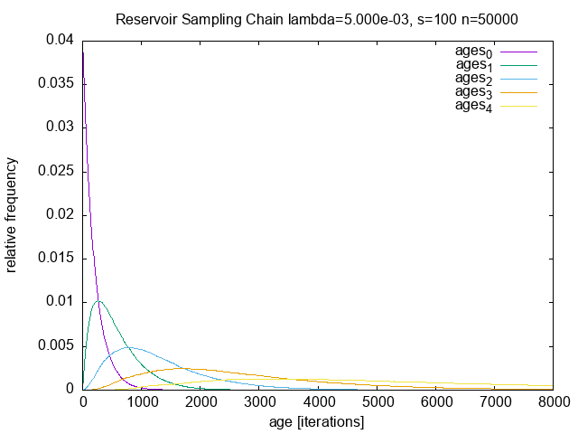

[](https://github.com/andremueller/goreservoir/actions/workflows/go.yml)

# Reservoir Sampling in Go

Implemented the **Biased Reservoir Sampling** approach [1] as a package in Go. A common interface may simplify to integrate further sampling techniques.

## Prerequisites

For compiling/running the examples the following tools are required:

- Go - <https://golang.org>
- gnuplot - <http://www.gnuplot.info/>, that's only for the example

### Mac OS X

- Install Homebrew <https://brew.sh/>
- `brew install go gnuplot`

## Sampler Interface

All samplers implement the following simple interface:

```go
type Sampler interface {
    // Add adds one or multiple samples to the Sampler.
    // Returns a set of dropped samples in this step.
    Add(samples []Sample) []Sample

    // Data returns a slice of the current samples within the Sampler.
    Data() []Sample

    // Reset resets the state of the sampler
    Reset()
}
```

Get the library
```go
go get -u github.com/andremueller/goreservoir
```

Use the library by including the algorithm in your code

```go
import "github.com/andremueller/goreservoir/pkg/reservoir"
```

The following algorithms are implemented:

- `Sliding` implements a basic sliding window <github.com/andremueller/goreservoir/pkg/window>.
- The `DynamicSampler` implements the Alg. 3.1 of [1] - the biased reservoir sampling <github.com/andremueller/goreservoir/pkg/reservoir>.
- The `EnsembleSampler` distributes the same data points to multiple samplers - so you can do some sort of bootstrapping.
- The `ChainSampler` can be used to stack the output (dropped points) of one sampler into the next one.

A simple example of the `ChainSampler` used together with a `DynamicSampler` can be found in <github.com/andremueller/goreservoir/cmd/reservoir/main.go>
Output of the example is the lingering time (in steps) how long a data point is in the reservoir.



## TODO

- Do some evaluation on open data sets such as <https://ti.arc.nasa.gov/tech/dash/groups/pcoe/prognostic-data-repository/>
- Provide more examples.

## References

- [1] Aggarwal, C. C. On biased reservoir sampling in the presence of stream evolution. in Proceedings of the 32nd international conference on Very large data bases 607–618 (ACM Press, 2006).
